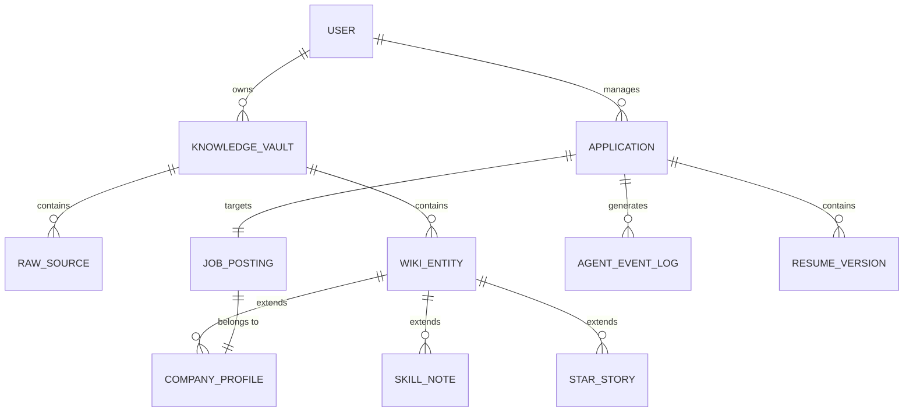

# Database ERD & Knowledge Graph Schema

To support the transition to a permanent Knowledge Vault and a Linear-style Application Tracker, our PostgreSQL (with JSONB) and Qdrant schema must evolve significantly.

## 1. Knowledge Layer Architecture

Instead of isolated rows, the Knowledge Layer acts as a centralized repository of context.

### The 4 Pillars of Knowledge
1. **`/raw`**: Immutable source data (HTML of Job Descriptions, raw emails, raw resumes).
2. **`/wiki`**: Structured, processed entities (Company Profiles, Recruiter Profiles, Synthesized Skill Notes).
3. **`/questions`**: Active gaps identified by the AI (Missing skills to learn, companies that need more research).
4. **`/digests`**: Aggregated insights (Weekly application velocity, skill trend reports).

## 2. Updated Entity Relationship Diagram (ERD)

## 3. Database Schema Updates (PostgreSQL)

The primary change is moving away from a monolithic `user_knowledge_base` table into distinct relational models with JSONB flexibility for dynamic traits.

### `wiki_entities` Table
A flexible table to store all permanent knowledge nodes.
- `id` (UUID)
- `user_id` (FK -> users)
- `entity_type` (Enum: Company, Skill, Project, Story)
- `title` (String)
- `content` (JSONB - The structured facts extracted by AI)
- `vector_id` (UUID - Links to Qdrant for semantic search)

### `applications` Table (Linear-Style CRM)
Expanded to track lifecycle stages precisely.
- `id` (UUID)
- `job_id` (FK -> jobs)
- `stage` (Enum: Wishlist, Research, Ready, Applied, OA, Interview, Offer, Rejected, Archived)
- `workflow_state` (JSONB - LangGraph persistence state)

### `agent_event_logs` Table
Essential for the AI Observability and Evidence Panels.
- `id` (UUID)
- `application_id` (FK -> applications)
- `agent_name` (String - e.g., "ATS Analyzer")
- `action_type` (String - e.g., "Diff Suggestion", "Web Search")
- `input_tokens` (Int)
- `output_tokens` (Int)
- `evidence` (JSONB - Why the agent made this decision)

## 4. Vector Store Strategy (Qdrant)

All `wiki_entities` and `raw_sources` will be embedded and stored in Qdrant. 
When an agent attempts to write a Cover Letter or optimize a Resume, it will perform a semantic search against the Vault to retrieve:
1. Past project experiences closely matching the Job Description requirements.
2. Previously stored research about the target Company's culture or tech stack.
