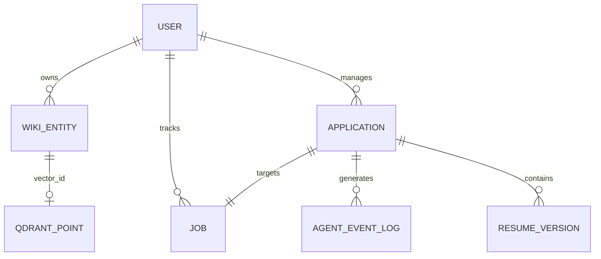

# Database ERD & Knowledge Graph Schema

PostgreSQL (JSONB) + Qdrant power the Knowledge Vault and Linear-style application tracker. This doc matches the **implemented** schema.

## 1. Knowledge Layer

### Pillars (product model)
1. **`/raw`** — Immutable sources (future: raw JD HTML, emails).  
2. **`/wiki`** — **Implemented** as `wiki_entities` rows.  
3. **`/questions`** — Gaps identified by agents (partially conceptual; can be `entity_type=question`).  
4. **`/digests`** — Aggregates (Analytics page covers telemetry digests today).

### Implemented wiki node
Each `WikiEntity` has `entity_type` (skill, company, project, story, experience, …), `title`, `content` JSONB, and optional `vector_id` linking to Qdrant.

## 2. ERD



## 3. PostgreSQL tables (key)

### `wiki_entities`
- `id`, `user_id`, `entity_type`, `title`, `content` (JSONB), `vector_id`, timestamps

### `applications`
- `stage`: Wishlist | Researching | Ready | Applied | Interview | Rejected  
- `workflow_state` JSONB  
- Unique `job_id` (one application per job)

### `agent_event_logs`
- `agent_name`, `action_type` (`execution` | `error`)  
- `input_tokens`, `output_tokens`, `latency_ms`, `evidence` JSONB

## 4. Qdrant (implemented)

| Setting | Value |
|---------|--------|
| Collection | `wiki_entities` |
| Distance | Cosine |
| Default dims | 768 (`nomic-embed-text`) |
| Payload | `user_id`, `entity_id`, `entity_type`, `title` |

**Code:** `backend/app/infrastructure/memory/vector_store.py`  
**Index on create:** `KnowledgeBaseService.create` embeds title+type+content and upserts.  
**Search:** `POST/GET /api/v1/knowledge/me/search`  
**Reindex:** `POST /api/v1/knowledge/me/reindex`

```bash
docker compose up -d qdrant ollama
docker compose exec ollama ollama pull nomic-embed-text
```

## 5. Tracker UI mapping

Kanban columns ↔ `applications.stage`. Drag-drop calls `PATCH /applications/{id}/stage`.
