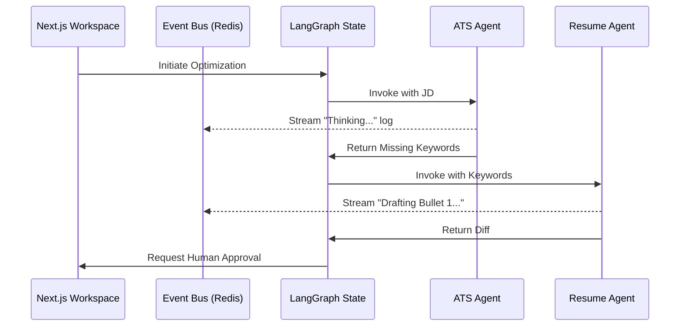

# Agent, Prompt, & Memory Architecture

To build a scalable and observable system, our LLM agents cannot be monolithic functions. They must be registered, modular, and maintain shared memory across the lifecycle of a job application.

## 1. Agent Registry Architecture

Instead of hardcoding agents into LangGraph nodes, we will implement an **Agent Registry**. This allows us to support a future Marketplace (Phase 15).

### Agent Definition Contract
Every agent must adhere to a strict interface:
1. **Name & Identity**: e.g., "Company Research Agent".
2. **Inputs**: Which keys from the LangGraph `AgentState` it requires (e.g., `job_description`).
3. **Outputs**: The specific Pydantic schema it guarantees to yield.
4. **Tools Allowed**: Does it have Playwright access? Vector DB access?

## 2. Prompt Architecture

Prompts will be abstracted out of Python files and stored in a versioned **Prompt Registry**.

### Structural Pattern
All system prompts will follow a standardized template:
- **Role**: "You are an ATS Keyword Analyst."
- **Context**: Dynamically injected from the Knowledge Vault (e.g., "The user has 5 years of Python experience").
- **Task**: "Extract missing keywords from the provided Job Description."
- **Constraints**: "Only suggest keywords if the user's past projects imply they might possess the skill."
- **Output Format**: Enforced implicitly via Instructor and Pydantic schemas.

## 3. Memory Architecture

Agents need two types of memory to operate effectively without hallucinating or losing context.

### Short-Term Memory (Session State)
Handled exclusively by **LangGraph's `AgentState`**. 
This state persists only for the duration of the current workflow execution (e.g., processing Application ID #123). It holds the raw job text, intermediate JSON extraction, and draft resumes.

### Long-Term Memory (The Knowledge Vault)
Handled by the **Knowledge Graph (Postgres + Qdrant)**.
If the Resume Optimizer Agent identifies that the user lacks "Docker" for a specific job, it shouldn't just complain. It should write to the `/questions` node in the Knowledge Vault: "Does the user know Docker?". 

Later, when the user logs in, the UI will prompt them: "You've had 3 jobs ask for Docker recently. Do you have any experience with it?" If the user answers yes and provides an anecdote, that story is permanently added to the `/wiki` as a `STAR_STORY`, making future resumes stronger.

## 4. Multi-Agent Communication

Agents communicate entirely through the Event Bus and the `AgentState`. 

