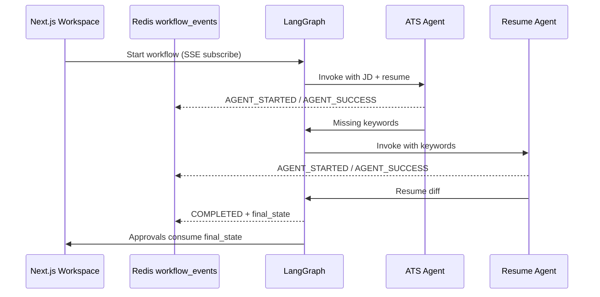

# Agent, Prompt, & Memory Architecture

Agents are registered, prompt-driven, and dual-memory (session + vault). Below is the **implemented** design.

## 1. Agent Registry (implemented)

- Base class: `OSAgent` in `application/agents/base.py`  
  - `run(state)` abstract  
  - `execute(state, application_id)` wraps telemetry, Redis events, Postgres `AgentEventLog`  
- Registry: `application/agents/registry.py` — LangGraph nodes resolve agents by name  
- Registered agents today: `job_intake_agent`, `ats_analyzer`, `resume_optimizer`, `cover_letter_agent`

### Contract
1. Name / description / capabilities  
2. Reads keys from LangGraph `AgentState`  
3. Returns a dict of state updates (Pydantic models via Instructor)  
4. Tools: LLM client shared; vector search available via Knowledge service (agents can call later)

## 2. Prompt Registry (implemented)

- YAML prompts under `app/core/prompts/*.yaml`  
- Loaded by `app/core/prompts/registry.py`  
- Template shape: Role, Context, Task, Constraints → Instructor enforces output schema

## 3. LLM client (implemented)

All agents use `infrastructure/llm/client.py`:

- OpenAI-compatible `AsyncOpenAI` (+ Instructor JSON mode for Ollama)  
- Model from `LLM_MODEL`  
- Mock fallbacks inside each agent when client is unavailable

## 4. Memory

### Short-term — LangGraph `AgentState`
Per workflow run: job text, ATS result, tailored resume, cover letter, flags like `requires_human_approval`.

### Long-term — Postgres WikiEntity + Qdrant (implemented)
- Create entity → embed → Qdrant upsert → store `vector_id`  
- Vault UI semantic search retrieves ranked entities  
- Future: inject top-k vault hits into Prompt “Context” for ATS / Cover Letter

Conceptual gap-filling (`/questions` → user answers → STAR story) remains a product roadmap item on top of this substrate.

## 5. Multi-agent communication

