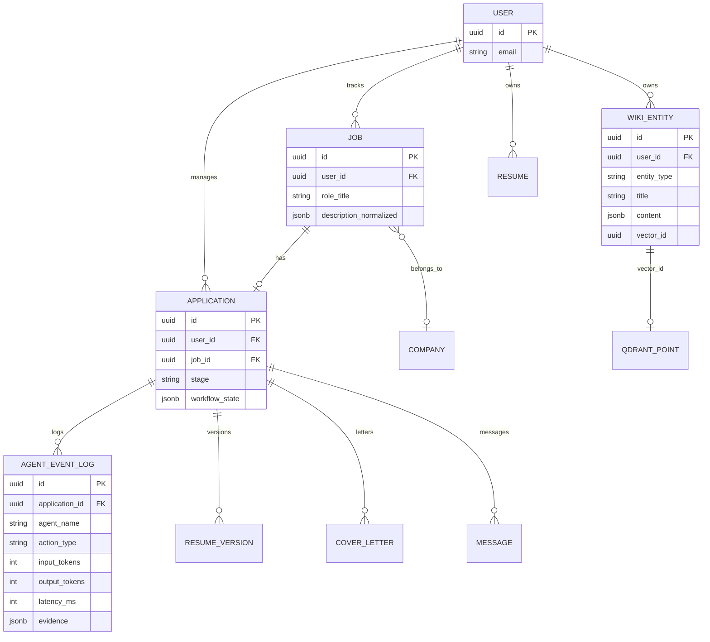
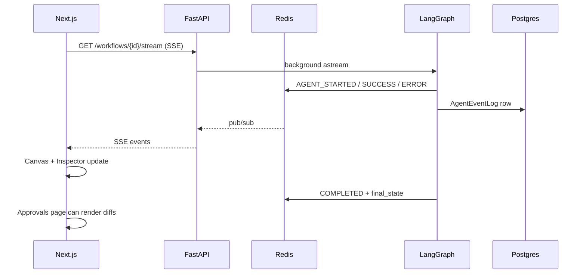

# Architecture Design Document: Career OS

Production-oriented architecture for the AI Job Application Assistant (**Career OS**). Reflects the **implemented** system (**Phases 0–11 complete**).

## 1. Folder Structure

```text
ai_powered_job_application_assistance_app/
├── backend/
│   ├── app/
│   │   ├── api/v1/endpoints/     # health, auth, knowledge, jobs, applications,
│   │   │                         # analytics, workflows, resumes, documents
│   │   ├── application/
│   │   │   ├── agents/           # OSAgent + registry + domain agents
│   │   │   └── services/         # use cases (job, knowledge, application, analytics…)
│   │   ├── core/                 # config, security, prompts/, logger
│   │   ├── domain/               # Pydantic domain models
│   │   ├── infrastructure/
│   │   │   ├── db/               # SQLAlchemy models + session
│   │   │   ├── events/           # Redis event bus
│   │   │   ├── llm/              # shared OpenAI-compatible client
│   │   │   ├── memory/           # embeddings + Qdrant vector store
│   │   │   └── scraping/         # Playwright/httpx job + company research
│   │   ├── schemas/              # API DTOs
│   │   ├── workflows/            # LangGraph state + graph
│   │   └── main.py
│   ├── alembic/
│   ├── tests/
│   ├── requirements.txt
│   └── Dockerfile
├── frontend/
│   └── src/
│       ├── app/(workspace)/      # canvas, vault, approvals, tracker, analytics
│       ├── components/           # layout, workflow, tracker, analytics, ui
│       ├── hooks/                # useWorkflowStore, useWorkflowStream
│       ├── lib/api.ts            # axios + demo auth helper
│       └── store/auth.ts
├── docs/
├── .github/workflows/ci.yml
├── docker-compose.yml            # postgres, redis, qdrant, ollama
├── cursor_context.md
└── README.md
```

## 2. Clean Architecture

1. **Domain** — Pydantic entities (`User`, `Job`, `Application`, `WikiEntity`, …).  
2. **Application** — Agents + services (no FastAPI imports in core agent logic beyond shared infra clients).  
3. **Infrastructure** — SQLAlchemy, Redis, Qdrant, OpenAI/Ollama client.  
4. **Presentation** — FastAPI routers + Next.js UI.

## 3. Database ERD (current)

`UserKnowledgeBase` was **removed**. Long-term facts live in `wiki_entities` (+ Qdrant).



### Application stages
`Wishlist` → `Researching` → `Ready` → `Applied` → `Interview` → `Rejected`

## 4. API Design (implemented)

Base URL: `http://localhost:8001/api/v1`

| Group | Highlights |
|-------|------------|
| Auth | `POST /auth/demo` — local JWT (frontend auto-bootstraps) |
| Agents | `GET /agents/`, `GET /agents/{name}`, `PUT /agents/{name}/prompt` (dev inspect/edit) |
| Knowledge | CRUD-ish `/knowledge/me` + `/search` + `/reindex` + `/seed-job-portals` |
| Applications | list/create + `PATCH /{id}/stage` |
| Analytics | `GET /analytics/summary` |
| Workflows | `GET /workflows/{job_id}/stream` (SSE) |
| Jobs | `POST /jobs/ingest` (Playwright scrape or raw text → Wishlist application) |
| Approvals | `POST /approvals/decide` |

## 5. LLM & embeddings

- **Chat**: `infrastructure/llm/client.py` — Instructor-wrapped `AsyncOpenAI` with **mock fallback** on errors.  
  - Local: `OPENAI_BASE_URL=http://localhost:11434/v1`, default model **`qwen2.5:3b`** (optional `qwen2.5:7b`)  
  - Cloud: empty base URL + OpenAI key + `gpt-4o`  
- **Scraping**: `infrastructure/scraping/` — job pages (Playwright→httpx→mock) and company signals (site/SERP/mock).  
- **Embeddings**: `infrastructure/memory/embeddings.py` — OpenAI-compatible embeddings API (`nomic-embed-text`) with deterministic hash fallback.  
- **Vectors**: Qdrant collection `wiki_entities`, cosine, filtered by `user_id`.

## 6. Agentic workflow & observability



Telemetry also powers **`/analytics`**.

## 7. Frontend workspace UX

Three-pane `WorkspaceLayout`: nav | main | Inspector; bottom Terminal.  
Pages: Canvas, Vault, Approvals, Tracker, Analytics.

## 8. Ports

| Service | Port |
|---------|------|
| Next.js | 3000 |
| FastAPI | **8001** |
| Postgres | 5432 |
| Redis | 6379 |
| Qdrant | 6333 |
| Ollama | 11434 |

## 9. Related docs

- [walkthrough.md](./walkthrough.md) — operational status  
- [implementation_plan.md](./implementation_plan.md) — checklist / backlog  
- [architecture/](./architecture/) — product & subsystem deep-dives  
