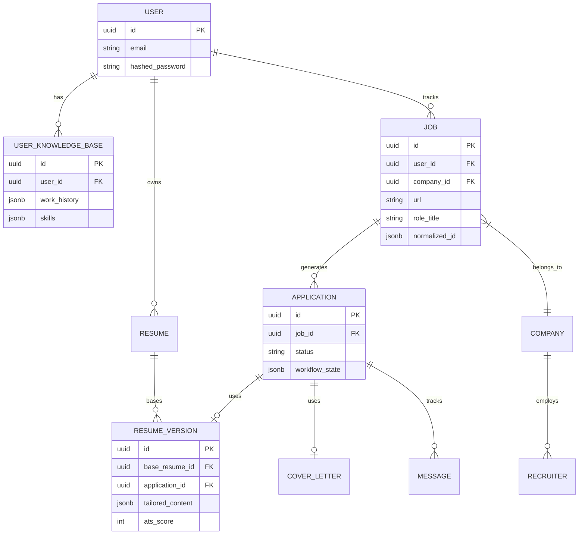
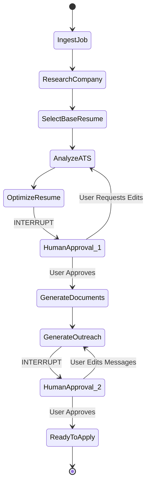
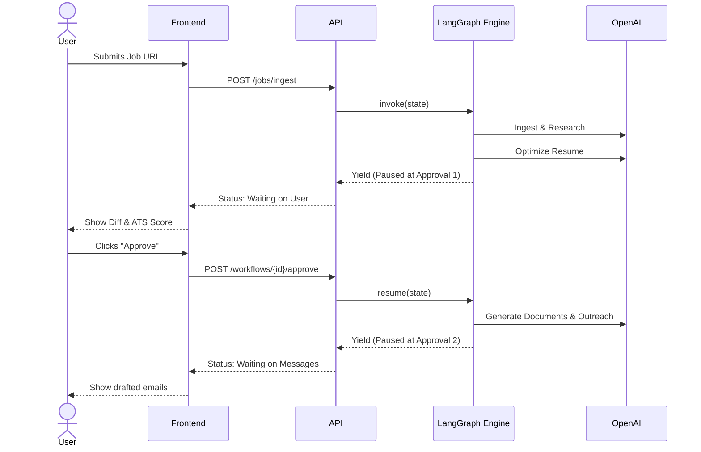
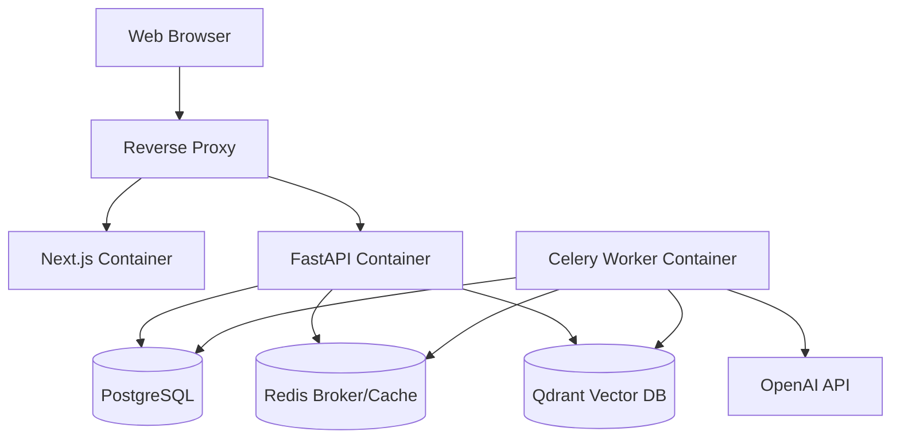

# Architecture Design Document: AI Job Application Assistant

This document outlines the production-grade architecture for the AI Job Application Assistant, adhering to Clean Architecture principles and a strictly human-in-the-loop agentic workflow.

## 1. Folder Structure

The project utilizes a monorepo approach with strict separation between frontend, backend, and infrastructure.

```text
ai_project/
├── backend/                  # Python FastAPI Backend
│   ├── app/
│   │   ├── api/              # Presentation Layer (FastAPI Routers)
│   │   ├── core/             # Framework configuration, security, DB session
│   │   ├── domain/           # Enterprise Business Rules (Entities, Pydantic schemas)
│   │   ├── application/      # Application Business Rules (Use cases, Agent orchestrators)
│   │   ├── infrastructure/   # Frameworks & Drivers (SQLAlchemy models, Qdrant client, OpenAI client)
│   │   ├── workers/          # Celery task definitions
│   │   └── workflows/        # LangGraph StateGraph definitions
│   ├── alembic/              # Database Migrations
│   ├── tests/                # Pytest suite
│   ├── requirements.txt
│   └── main.py
├── frontend/                 # Next.js 14 Frontend
│   ├── src/
│   │   ├── app/              # App Router (Pages & Layouts)
│   │   ├── components/       # Shared UI (Shadcn, Tailwind)
│   │   ├── features/         # Feature-based modules (Jobs, Resumes, Agents)
│   │   ├── lib/              # API Client (Axios), Utils
│   │   └── store/            # Global State (Zustand)
│   └── package.json
├── docker/
│   ├── docker-compose.yml
│   ├── backend.Dockerfile
│   └── frontend.Dockerfile
└── docs/                     # Architecture & API documentation
```

## 2. Clean Architecture Implementation

The backend follows the Dependency Rule: source code dependencies must point only inward, toward higher-level policies.

1. **Domain Layer (Inner-most)**: Contains pure Python objects and Pydantic models representing business entities (`User`, `Resume`, `Job`, `Application`). No knowledge of DB or APIs.
2. **Application Layer**: Contains Use Cases and Agent Logic. Orchestrates the flow of data using LangGraph. Interfaces are defined here (e.g., `JobRepositoryInterface`).
3. **Infrastructure Layer**: Implements interfaces defined in the Application layer. Contains SQLAlchemy models, external API integrations (OpenAI, Playwright), and Vector DB logic.
4. **Presentation Layer (Outer-most)**: FastAPI routes parsing incoming HTTP requests and mapping them to Application Use Cases.

## 3. Database ERD (Entity Relationship Diagram)



## 4. API Design

The API is RESTful, with specialized endpoints for workflow state management.

### Core Endpoints
- `POST /api/v1/auth/token` - JWT authentication
- `GET /api/v1/jobs` - List jobs
- `POST /api/v1/jobs/ingest` - Accepts URL/PDF/Text, triggers Celery task.
- `GET /api/v1/resumes/base` - CRUD for base JSON resumes

### Workflow & Agent Endpoints
- `POST /api/v1/workflows/applications/{app_id}/start` - Initializes LangGraph
- `GET /api/v1/workflows/applications/{app_id}/state` - Returns current LangGraph node and state.
- `POST /api/v1/workflows/applications/{app_id}/approve` - Submits user approval to resume paused graph.
- `POST /api/v1/workflows/applications/{app_id}/feedback` - Submits user feedback (e.g., "Make the tone more aggressive"), rewinding the graph state.

## 5. Agent Architecture

Agents are stateless, single-responsibility LLM chains. They receive typed inputs and guarantee typed JSON outputs via OpenAI tool calling (`bind_tools`).

1. **Job Intake Agent**: `URL -> Playwright -> Markdown -> LLM -> NormalizedJobSchema`
2. **Company Research Agent**: `CompanyName -> SERP API/Playwright -> LLM -> CompanyProfileSchema`
3. **ATS Scoring Agent**: `NormalizedJob + ResumeJSON -> LLM -> ATSScoreSchema (with deductions)`
4. **Resume Optimization Agent**: `ResumeJSON + ATSScore + Job -> LLM -> TailoredResumeJSON`
5. **Document Gen Agent (Non-LLM)**: `TailoredResumeJSON -> WeasyPrint/python-docx -> PDF/DOCX`
6. **Outreach Agent**: `RecruiterProfile + Job + UserProfile -> LLM -> MessageDraftsSchema`

## 6. LangGraph Workflows

The application tailoring process is modeled as a cyclic graph with strict `interrupt_before` breakpoints for human-in-the-loop validation.



## 7. Sequence Diagrams

**End-to-End Execution with Human Approval:**



## 8. Deployment Architecture

Containerized microservices deployed via Docker Compose (or Kubernetes).



## 9. Security Model

- **Authentication**: JWT access/refresh tokens. Passwords hashed via Bcrypt.
- **Authorization**: Role-based (User vs Admin). Users can only access jobs/resumes belonging to their `user_id`.
- **Data Privacy (PII Masking)**: Before sending resume JSON to OpenAI, a presidio-based regex filter can optionally scrub Phone Numbers/Addresses, injecting them back during document generation.
- **Rate Limiting**: Redis-based rate limiting on LLM-triggering endpoints to prevent cost overruns.
- **Secrets Management**: Environment variables loaded via Pydantic `BaseSettings`.

## 10. Tech Decisions with Tradeoffs

| Component | Choice | Alternative Considered | Tradeoff Rationale |
| :--- | :--- | :--- | :--- |
| **Backend Language** | **Python (FastAPI)** | Node.js / TS | Python dominates the AI/LLM ecosystem (LangChain/LangGraph). FastAPI provides high async performance. |
| **Database** | **PostgreSQL (JSONB)** | MongoDB | Postgres JSONB provides NoSQL flexibility for resumes, while maintaining strict relational integrity for Users/Jobs/Apps. |
| **Workflow Engine** | **LangGraph** | Standard Celery Chains | LangGraph natively handles cyclic state, LLM memory, and human-in-the-loop checkpoints much better than DAG-only Celery. Celery is still used to asynchronously run the LangGraph executor. |
| **Vector Search** | **Qdrant** | pgvector | Qdrant is purpose-built, faster to spin up without complex Postgres extensions, and scales well for semantic skill matching. |
| **Browser Auto** | **Playwright** | Selenium | Playwright is faster, handles modern SPAs (React/Angular ATS systems) flawlessly, and is headless by default. |
